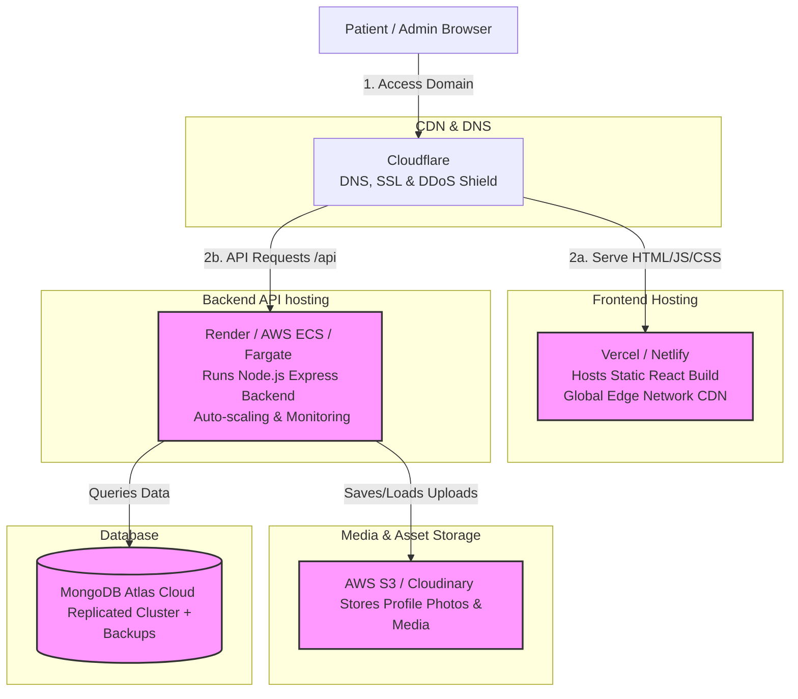

# Production-Level Deployment Architecture

This document describes how the **Aakaa Website** is hosted, scaled, and secured in a live production environment. It provides a technical blueprint for devops, developers, and stakeholders who want to know how the system operates in the real world.

---

## 🌐 Production Deployment Flow

---

## 1. Frontend Hosting (React Web App)
In production, a React Single Page Application (SPA) does *not* need a running server. Instead, Vite compiles the code into static files (HTML, CSS, JS).
* **Recommended Host**: **Vercel** or **Netlify** (or **AWS S3 + CloudFront**).
* **Why**: 
  * **Global Distribution (CDN)**: The static pages are cached at edge locations globally, leading to near-instant loading times for users.
  * **Continuous Integration (CI/CD)**: Pushing code changes to GitHub automatically triggers a production build and deployment.
  * **SSL/HTTPS**: Automatically handles issuing and renewing SSL certificates for HTTPS security.

---

## 2. Backend Hosting (Node.js API)
The Node.js Express server is a dynamic application that must run continuously to process bookings, authentication, and payments.
* **Recommended Host**: **Render** (e.g. Web Service), **DigitalOcean App Platform**, or **AWS ECS / Fargate** (containerized via Docker).
* **Why**:
  * **Auto-Scaling**: Automatically scales up instances of the server to handle high traffic spikes.
  * **Health Checks**: Monitors the health of the server and automatically restarts crashed instances.
  * **Access Whitelisting**: Allows configuring firewall rules to only permit incoming web traffic on port 443 (HTTPS).

---

## 3. Database Hosting (MongoDB Atlas)
For production, the local MongoDB is replaced by a managed database in the cloud.
* **Recommended Host**: **MongoDB Atlas** (Shared or Dedicated Cloud Cluster).
* **Why**:
  * **High Availability (Replica Sets)**: Spreads the database across multiple physical servers (usually 3). If one server goes down, another automatically takes over with zero data loss.
  * **IP Whitelisting**: The database firewall is configured to *only* accept connections coming from the Backend Server's IP address, blocking external hacker attempts.
  * **Automated Backups**: Hourly or daily point-in-time database snapshots for disaster recovery.

---

## 4. Media & Asset Storage (AWS S3)
Because cloud servers are ephemeral (they reset their disks whenever code is updated or scaled), we cannot save uploaded therapist profile photos or blog images directly on the backend disk.
* **Recommended Host**: **AWS S3** (Simple Storage Service) or **Cloudinary** (for image optimization).
* **Why**:
  * **Persistent Storage**: Uploaded files remain saved forever.
  * **CDN Acceleration**: Directly delivers photos to users at lighting speeds without hitting the Node.js backend, reducing server load.

---

## 🔒 Production Security Measures

1. **HTTPS Enforcement**: All traffic is routed through Cloudflare to encrypt sensitive user data (passwords, payment receipts) in transit.
2. **Environment Variable Isolation**: Critical keys (Razorpay Secret, database credentials, JWT secrets) are stored in secure environment vaults on the hosting providers, never checked into GitHub.
3. **CORS Restrictions**: The backend API is configured to strictly only accept requests originating from `https://yourdomain.com` (your frontend), blocking unauthorized domains from calling your endpoints.
