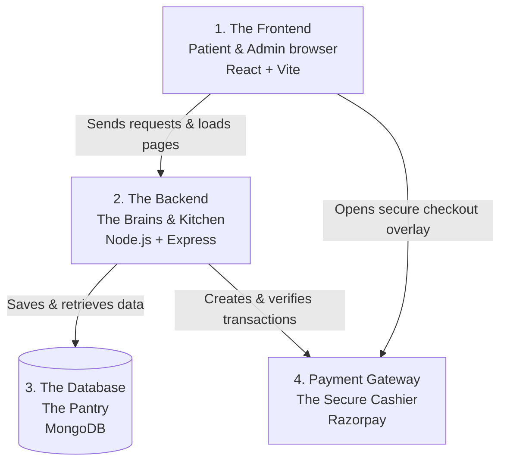

# Aakaa Website Architecture (Non-Technical Overview)

This document explains the technical structure (architecture) of the **Aakaa Website** in simple, plain English. You can use this guide to explain how the platform works to team members, clients, or non-technical business stakeholders.

---

## 🏗️ The 3-Tier Architecture
The website uses a standard **3-Tier Architecture** (like a restaurant: Front-of-House, Kitchen, and Pantry).

---

## 1. The Frontend (Front-of-House)
* **What it is**: The actual visual pages that users see in their web browser (Safari, Chrome, etc.).
* **Technologies**: React & Vite.
* **Analogy**: The dining room of a restaurant where guests sit, look at the menu, and place orders.
* **Main Sections**:
  * **Public Patient Portal**: Where patients explore therapists, filter by price (min ₹499) and availability, pick scheduling slots, and book somatic yoga classes.
  * **Secure Admin Dashboard**: Where the website managers log in (using secure credentials) to manage waitlists, approve payout requests, check revenue statistics, and onboard therapists.

---

## 2. The Backend (The Kitchen)
* **What it is**: The hidden server engine that processes commands. It is not visible to the user but does all the heavy calculations and logical checks.
* **Technologies**: Node.js & Express.
* **Analogy**: The kitchen where the chefs receive orders from the waiters, cook the food, and package it.
* **Key Functions**:
  * **Gatekeeping (Auth)**: Makes sure only authorized admins can access dashboard stats.
  * **Business Logic**: Automatically calculates platform fees, commissions, and prevents two patients from booking the exact same therapist slot at the same time (double-booking protection).
  * **API Endpoints**: Serves as the middleman translation layer between the user's browser actions and the database records.

---

## 3. The Database (The Pantry)
* **What it is**: The secure filing cabinet where all website data is permanently stored.
* **Technologies**: MongoDB.
* **Analogy**: The pantry/fridge where all raw ingredients are labeled, organized, and stored for later.
* **What it saves**:
  * **Therapist Profiles**: Names, bios, pricing structure, private email IDs, and specialties.
  * **Class & Session Bookings**: Date, time, buyer email, status, and Google Meet video links.
  * **Waitlist Queue**: Contact list of interested users awaiting platform access.

---

## 4. Payment Gateway (The Cashier)
* **What it is**: A secure 3rd-party bank payment system.
* **Technologies**: Razorpay.
* **Analogy**: The card reader terminal or cashier desk at the exit of the restaurant.
* **Why it is separate**: For safety and compliance, the website does *not* save credit card numbers directly. Instead, it securely handshakes with Razorpay, which safely collects UPI/Card payments and tells our backend: *"Yes, the payment was successful. You can confirm the booking now."*

---

## 🔄 Example Flow: Patient Booking a Therapist

1. **Patient filters and selects a slot**: The patient selects a therapist for ₹499 at 11:30 AM on Monday and inputs their email address.
2. **Backend creates a temporary order**: The frontend requests the backend to generate a secure transaction ticket.
3. **Secure Checkout**: A secure Razorpay window pops up. The patient pays using UPI, Card, or Net Banking.
4. **Backend Confirms & Saves**: Once payment is approved, the backend saves a new **Booking** record in the database.
5. **Meeting Link Assigned**: A mock Google Meet link is assigned to the booking, and a confirmation email is dispatched to both the patient and the therapist.
